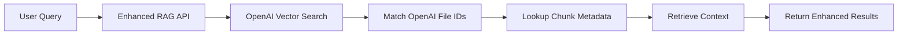

# Enhanced RAG Architecture Documentation

## Overview

The Eris Debate platform now features an enhanced Retrieval-Augmented Generation (RAG) system that allows users to:
- Search through debate evidence with semantic understanding
- View original PDF documents with direct page navigation
- See surrounding context for each search result
- Access documents from opencaselist.com automatically

## Architecture Components

### 1. Document Storage Layer

#### Supabase Storage
- **Bucket**: `debate-documents`
- **Access**: Public read access for all PDFs
- **Naming**: Timestamp + hash + filename for uniqueness

#### Database Schema
```sql
-- documents table: Stores PDF metadata
documents:
  - id: UUID (primary key)
  - title: Text
  - file_name: Text
  - file_url: Text (Supabase Storage URL)
  - page_count: Integer
  - source_type: Enum ('upload', 'opencaselist', 'other')
  - metadata: JSONB (camp, year, topic, etc.)
  - indexed_at: Timestamp

-- document_chunks table: Stores chunk positions
document_chunks:
  - id: UUID (primary key)
  - document_id: UUID (foreign key)
  - chunk_index: Integer
  - content: Text
  - page_number: Integer
  - page_start_char: Integer
  - page_end_char: Integer
  - openai_file_id: Text
  - section_title: Text
```

### 2. Indexing Pipeline

#### Enhanced Indexing Service
1. **PDF Processing**: Uses `pdf-parse` to extract text and structure
2. **Smart Chunking**: 
   - 800 token chunks with 200 token overlap
   - Preserves section boundaries
   - Tracks exact character positions
3. **Metadata Enrichment**:
   - Embeds source, page, and section info in each chunk
   - Maintains chunk relationships for context retrieval

#### OpenAI Vector Store Integration
- Chunks uploaded as individual files to OpenAI
- Metadata preserved in filenames
- Batch processing for efficiency

### 3. Search Implementation

#### Three Search Modes

1. **Assistant Search** (`/api/wiki-search`)
   - Uses OpenAI Assistant API
   - Returns AI-processed summaries
   - Best for general queries

2. **RAG Search** (`/api/wiki-rag-search`)
   - Direct chunk retrieval
   - Shows raw document excerpts
   - Limited metadata

3. **Enhanced RAG Search** (`/api/wiki-rag-search-enhanced`)
   - Full PDF navigation support
   - Surrounding context display
   - Direct page links

#### Search Flow


### 4. UI Components

#### EnhancedSearchCardWithPDF
- Displays chunk content with expand/collapse
- Shows surrounding context on demand
- "View in PDF" button for direct navigation
- Page number and relevance score badges

#### SimplePDFViewer
- Modal PDF viewer
- Page navigation support
- Download option
- Fallback embed for compatibility

### 5. Web Scraping System

#### OpenCaseListScraper
- Automated login to opencaselist.com
- Downloads debate evidence files
- Extracts metadata (camp, year, topic)
- Tracks scraping progress in database

#### Scraping Workflow
1. Login with provided credentials
2. Navigate to /openev section
3. Extract all PDF/DOC links
4. Download and store in Supabase
5. Trigger indexing for each file

### 6. Admin Interface

#### Document Management (`/admin/documents`)
- Upload new PDFs manually
- Trigger opencaselist scraping
- Re-index documents
- View indexing status
- Delete documents

#### API Endpoints
- `POST /api/admin/upload-document` - Manual PDF upload
- `POST /api/admin/reindex-document` - Re-index single document
- `POST /api/admin/scrape-opencaselist` - Start web scraping
- `GET /api/admin/scrape-status` - Check scraping progress

## Usage Guide

### For Users

1. **Searching**:
   - Select "Enhanced RAG" mode for best results
   - Enter debate-related queries
   - Click "View in PDF" to see original context

2. **Understanding Results**:
   - Blue badges show page numbers
   - Percentage shows relevance score
   - "Show surrounding context" reveals adjacent text
   - Click document title to expand full chunk

### For Administrators

1. **Initial Setup**:
   ```bash
   # Run database migrations
   npm run db:migrate
   
   # Install dependencies
   npm install puppeteer pdf-parse
   ```

2. **Scraping OpenCaseList**:
   - Navigate to `/admin/documents`
   - Click "Scrape OpenCaseList"
   - Monitor progress in the UI

3. **Re-indexing Documents**:
   ```bash
   # Re-index all documents
   node scripts/reindex-documents.js
   ```

## Technical Details

### Performance Optimizations
- Result caching (1 hour TTL)
- Batch file uploads to OpenAI
- Lazy loading of PDF viewer
- Parallel chunk processing

### Security Considerations
- Admin endpoints require authentication
- Public read-only access to PDFs
- RLS policies on all tables
- Sanitized user inputs

### Limitations
- OpenAI vector store doesn't provide direct embedding access
- PDF.js viewer requires CORS-enabled storage
- Large PDFs may take time to index
- Maximum 512MB per PDF file

## Future Enhancements

1. **Advanced Search**:
   - Filter by camp, year, topic
   - Date range queries
   - Author attribution

2. **Improved Context**:
   - Highlight search terms in PDFs
   - Show document outline/TOC
   - Cross-reference citations

3. **Collaboration Features**:
   - Save searches with annotations
   - Share specific chunks
   - Team workspaces

## Troubleshooting

### Common Issues

1. **"No chunks found" error**:
   - Document may not be indexed yet
   - Check document status in admin panel
   - Re-index if necessary

2. **PDF viewer not loading**:
   - Check browser console for CORS errors
   - Ensure Supabase Storage bucket is public
   - Try download option as fallback

3. **Scraping fails**:
   - Verify opencaselist credentials
   - Check for site structure changes
   - Review scrape logs in database

### Debug Commands
```bash
# Check document count
npm run supabase db query "SELECT COUNT(*) FROM documents"

# View indexing status
npm run supabase db query "SELECT file_name, indexed_at FROM documents ORDER BY created_at DESC LIMIT 10"

# Clear search cache
npm run supabase db query "DELETE FROM search_results_cache WHERE expires_at < NOW()"
```

## API Reference

### Enhanced Search Request
```typescript
POST /api/wiki-rag-search-enhanced
{
  "query": "string",
  "maxResults": 10 // optional, default 10
}
```

### Enhanced Search Response
```typescript
{
  "success": true,
  "searchType": "enhanced-rag",
  "results": [{
    "content": "string",
    "source": "string", 
    "score": 0.95,
    "chunk_id": "uuid",
    "document_id": "uuid",
    "page_number": 42,
    "pdf_url": "https://...",
    "pdf_page_anchor": "#page=42",
    "context": {
      "before": "string",
      "after": "string"
    },
    "metadata": {
      "title": "string",
      "section": "string",
      "source_type": "opencaselist",
      "indexed_at": "2024-01-17T..."
    }
  }]
}
```

This enhanced RAG system provides debate teams with powerful evidence search capabilities while maintaining the ability to verify sources in their original context.