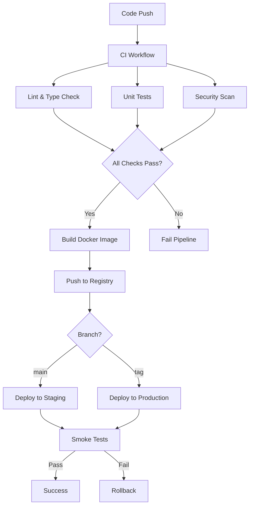

# DebateAI CI/CD Setup Guide

## Overview

This document provides a comprehensive guide to the CI/CD pipeline setup for DebateAI. The pipeline uses GitHub Actions to automate testing, building, security scanning, and deployment processes.

## Table of Contents

1. [Pipeline Architecture](#pipeline-architecture)
2. [Workflows](#workflows)
3. [Environment Setup](#environment-setup)
4. [Secrets Configuration](#secrets-configuration)
5. [Deployment Process](#deployment-process)
6. [Monitoring and Alerts](#monitoring-and-alerts)
7. [Troubleshooting](#troubleshooting)

## Pipeline Architecture



## Workflows

### 1. CI Workflow (`.github/workflows/ci.yml`)

**Triggers:**
- Push to `main` branch
- Pull requests to `main` branch

**Jobs:**
- **Lint and Type Check**: Ensures code quality and type safety
- **Unit Tests**: Runs Jest tests with coverage reporting
- **Build Verification**: Validates production build
- **Docker Build Test**: Ensures Docker image builds successfully
- **Secret Scanning**: Checks for exposed secrets using GitLeaks

### 2. Security Workflow (`.github/workflows/security.yml`)

**Triggers:**
- Push to `main` or `develop` branches
- Pull requests
- Daily scheduled scan at 2 AM UTC
- Manual dispatch

**Jobs:**
- **CodeQL Analysis**: Static code analysis for security vulnerabilities
- **Dependency Scan**: Checks npm dependencies for known vulnerabilities
- **Secret Scanning**: Deep scan for exposed credentials
- **Container Scan**: Vulnerability scanning of Docker images
- **OWASP Check**: Dependency vulnerability assessment
- **License Compliance**: Ensures compatible open-source licenses

### 3. Test Workflow (`.github/workflows/test.yml`)

**Triggers:**
- Push to `main` or `develop` branches
- Pull requests
- Daily scheduled run at 3 AM UTC
- Manual dispatch

**Jobs:**
- **Unit Tests**: Component and utility testing
- **Integration Tests**: Database and API integration testing
- **API Tests**: Postman/Newman API endpoint testing
- **E2E Tests**: Playwright browser automation tests
- **Performance Tests**: Lighthouse and k6 load testing
- **Accessibility Tests**: Axe-core accessibility compliance

### 4. Deploy Workflow (`.github/workflows/deploy.yml`)

**Triggers:**
- Push to `main` branch (staging deployment)
- Version tags `v*.*.*` (production deployment)
- Manual dispatch with environment selection

**Jobs:**
- **Build and Push**: Multi-platform Docker image creation
- **Deploy Staging**: Automated staging deployment
- **Deploy Production**: Production deployment with approval
- **Smoke Tests**: Post-deployment verification
- **Rollback**: Automatic rollback on failure

### 5. Release Workflow (`.github/workflows/release.yml`)

**Triggers:**
- Push to `main` branch
- Manual dispatch with release type selection

**Jobs:**
- **Version Bump**: Semantic versioning based on commits
- **Changelog Generation**: Automated changelog from commits
- **GitHub Release**: Creates release with notes
- **Asset Building**: Multi-architecture Docker images
- **Documentation Update**: Updates version references
- **Team Notification**: Notifies team of release status

## Environment Setup

### Required GitHub Environments

1. **staging**
   - URL: `https://staging.debateai.com`
   - Required reviewers: None
   - Deployment branch: `main`

2. **production**
   - URL: `https://debateai.com`
   - Required reviewers: 1-2 team members
   - Deployment branch: `main` (tags only)

### Environment Variables

Create these environments in your repository settings:

```yaml
# Staging Environment
STAGING_HOST: staging.debateai.com
STAGING_DATABASE_URL: postgresql://...

# Production Environment
PRODUCTION_HOST: debateai.com
PRODUCTION_DATABASE_URL: postgresql://...
```

## Secrets Configuration

### Required Repository Secrets

```bash
# Core Application Secrets
NEXT_PUBLIC_SUPABASE_URL          # Supabase project URL
NEXT_PUBLIC_SUPABASE_ANON_KEY     # Supabase anonymous key
SUPABASE_SERVICE_ROLE_KEY         # Supabase service role key
OPENAI_API_KEY                    # OpenAI API key
OPENAI_VECTOR_STORE_ID            # OpenAI vector store ID
ELEVENLABS_API_KEY                # ElevenLabs API key

# Test Environment Secrets
TEST_SUPABASE_URL                 # Test Supabase URL
TEST_SUPABASE_ANON_KEY            # Test Supabase anonymous key
TEST_SUPABASE_SERVICE_ROLE_KEY    # Test service role key

# Deployment Secrets
STAGING_HOST                      # Staging server hostname
STAGING_USER                      # Staging server SSH user
STAGING_SSH_KEY                   # Staging server SSH private key
STAGING_DATABASE_URL              # Staging database connection

PRODUCTION_HOST                   # Production server hostname
PRODUCTION_USER                   # Production server SSH user
PRODUCTION_SSH_KEY                # Production server SSH private key
PRODUCTION_DATABASE_URL           # Production database connection

# Optional Integration Secrets
SNYK_TOKEN                        # Snyk security scanning
CODECOV_TOKEN                     # Code coverage reporting
SENTRY_DSN                        # Error tracking
SLACK_WEBHOOK_URL                 # Team notifications
```

### Setting Up Secrets

1. Navigate to repository Settings → Secrets and variables → Actions
2. Click "New repository secret"
3. Add each secret with its corresponding value
4. For SSH keys, ensure they're in PEM format:
   ```bash
   # Generate SSH key pair
   ssh-keygen -t rsa -b 4096 -f deploy_key -N ""
   
   # Copy private key content to GitHub secret
   cat deploy_key
   ```

## Deployment Process

### Staging Deployment

1. **Automatic Trigger**: Push to `main` branch
2. **Process**:
   - Build Docker image with latest changes
   - Push to GitHub Container Registry
   - SSH to staging server
   - Pull and deploy new image
   - Run database migrations
   - Verify health check

### Production Deployment

1. **Manual Release**:
   ```bash
   # Create and push a version tag
   git tag v1.2.3
   git push origin v1.2.3
   ```

2. **GitHub UI Release**:
   - Go to Actions → Release workflow
   - Click "Run workflow"
   - Select release type (patch/minor/major)

3. **Process**:
   - Requires manual approval
   - Zero-downtime deployment
   - Automatic rollback on failure
   - Post-deployment smoke tests

### Emergency Rollback

```bash
# SSH to production server
ssh user@debateai.com

# List recent images
docker images | grep debateai

# Rollback to previous version
docker-compose down
docker-compose up -d debateai:v1.2.2
```

## Monitoring and Alerts

### Health Checks

All deployments include health check endpoints:
- Staging: `https://staging.debateai.com/api/health`
- Production: `https://debateai.com/api/health`

### Workflow Notifications

Configure notifications in `.github/workflows/*.yml`:

```yaml
- name: Notify Slack
  if: failure()
  uses: 8398a7/action-slack@v3
  with:
    status: ${{ job.status }}
    webhook_url: ${{ secrets.SLACK_WEBHOOK_URL }}
```

### Monitoring Dashboard

Access GitHub Actions insights:
1. Repository → Actions tab
2. View workflow runs
3. Check deployment environments
4. Monitor workflow usage and billing

## Troubleshooting

### Common Issues

#### 1. Docker Build Failures

```bash
# Check Docker build locally
docker build -t debateai:test .

# Debug with build arguments
docker build --build-arg NEXT_PUBLIC_SUPABASE_URL=test .
```

#### 2. Test Failures

```bash
# Run specific test suite locally
npm run test:unit
npm run test:integration
npm run test:e2e

# Debug with verbose output
npm test -- --verbose --detectOpenHandles
```

#### 3. Deployment Failures

```bash
# Check deployment logs
ssh user@server "docker logs debateai_web_1"

# Verify environment variables
ssh user@server "docker exec debateai_web_1 env | grep NEXT_"

# Check disk space
ssh user@server "df -h"
```

#### 4. Secret/Environment Issues

```bash
# Validate secrets locally
npm run check:env

# Test with production-like environment
cp .env.example .env.production.local
# Fill in production values
npm run build
npm run start
```

### Debugging Workflows

1. **Enable debug logging**:
   - Add secret: `ACTIONS_RUNNER_DEBUG: true`
   - Add secret: `ACTIONS_STEP_DEBUG: true`

2. **Re-run with debug**:
   - Click "Re-run all jobs" → "Enable debug logging"

3. **Download artifacts**:
   - Check workflow run → Artifacts section
   - Download logs and test results

### Performance Optimization

1. **Cache Dependencies**:
   ```yaml
   - uses: actions/setup-node@v4
     with:
       cache: 'npm'
   ```

2. **Parallel Jobs**:
   - Run independent tests in parallel
   - Use job matrices for multiple configurations

3. **Conditional Workflows**:
   ```yaml
   if: github.event_name == 'push' || 
       contains(github.event.pull_request.labels.*.name, 'run-e2e')
   ```

## Best Practices

1. **Commit Messages**: Follow conventional commits for automatic versioning
   ```
   feat: add new debate format
   fix: resolve socket connection issue
   docs: update API documentation
   chore: upgrade dependencies
   ```

2. **Branch Protection**: Enable these rules for `main`:
   - Require pull request reviews
   - Require status checks to pass
   - Require branches to be up to date
   - Include administrators

3. **Security**:
   - Rotate secrets regularly
   - Use environment-specific secrets
   - Enable Dependabot security updates
   - Review security alerts promptly

4. **Monitoring**:
   - Set up workflow failure alerts
   - Monitor deployment frequency
   - Track build times and optimize
   - Review security scan results

## Maintenance Schedule

- **Daily**: Automated security scans and tests
- **Weekly**: Review and merge Dependabot PRs
- **Monthly**: Rotate deployment keys and tokens
- **Quarterly**: Review and update CI/CD workflows

---

For additional help, consult the [GitHub Actions documentation](https://docs.github.com/en/actions) or reach out to the DevOps team.