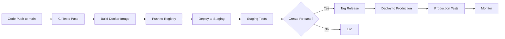

# Eris Debate Deployment Process

## Overview

This document outlines the deployment process for Eris Debate, including staging and production deployments, rollback procedures, and best practices.

## Table of Contents

1. [Deployment Flow](#deployment-flow)
2. [Staging Deployment](#staging-deployment)
3. [Production Deployment](#production-deployment)
4. [Manual Deployment](#manual-deployment)
5. [Rollback Procedures](#rollback-procedures)
6. [Health Checks](#health-checks)
7. [Monitoring](#monitoring)
8. [Troubleshooting](#troubleshooting)

## Deployment Flow



## Staging Deployment

### Automatic Staging Deployment

Staging deployments are triggered automatically when code is pushed to the `main` branch.

```bash
# Merge PR to main
git checkout main
git pull origin main
git merge feature-branch
git push origin main
```

### Deployment Process

1. **CI/CD Pipeline Triggers**
   - Runs all tests
   - Builds Docker image
   - Pushes to GitHub Container Registry

2. **Deployment Steps**
   ```yaml
   # Automated by deploy.yml workflow
   - SSH to staging server
   - Pull latest Docker image
   - Run database migrations
   - Start new containers
   - Verify health checks
   ```

3. **Verification**
   - Check staging URL: https://staging.erisdebate.com
   - Review deployment logs in GitHub Actions
   - Test core functionality

### Manual Staging Deployment

```bash
# Trigger staging deployment manually
gh workflow run deploy.yml -f environment=staging
```

## Production Deployment

### Release-Based Deployment

Production deployments are triggered by creating a version tag:

```bash
# Create and push a release tag
git tag -a v1.2.3 -m "Release version 1.2.3"
git push origin v1.2.3
```

### GitHub Release Workflow

1. **Using GitHub UI**
   ```
   Actions → Release workflow → Run workflow
   Select release type: patch/minor/major
   ```

2. **Automatic Process**
   - Bumps version in package.json
   - Generates changelog
   - Creates GitHub release
   - Triggers production deployment

### Production Deployment Steps

1. **Pre-deployment Checks**
   - All tests pass
   - Staging deployment successful
   - Manual approval (if configured)

2. **Zero-Downtime Deployment**
   ```bash
   # Performed automatically by workflow
   docker-compose pull
   docker-compose up -d --scale web=2 --no-recreate web
   # Health check new containers
   docker-compose up -d --scale web=1 --no-recreate web
   ```

3. **Post-deployment**
   - Run database migrations
   - Verify health checks
   - Run smoke tests
   - Monitor metrics

## Manual Deployment

### Prerequisites

```bash
# Install required tools
npm install -g gh  # GitHub CLI
docker --version   # Docker
ssh-keygen        # SSH keys
```

### Manual Staging Deployment

```bash
# SSH to staging server
ssh deploy@staging.erisdebate.com

# Navigate to application directory
cd /opt/eris-debate

# Pull latest changes
git pull origin main

# Build and deploy
docker-compose build
docker-compose up -d

# Run migrations
docker-compose exec web npm run migrate:deploy

# Check logs
docker-compose logs -f web
```

### Manual Production Deployment

```bash
# SSH to production server
ssh deploy@erisdebate.com

# Navigate to application directory
cd /opt/eris-debate

# Create backup
./scripts/backup.sh

# Pull specific version
git fetch --tags
git checkout v1.2.3

# Deploy with zero downtime
docker-compose pull
docker-compose up -d --scale web=2 --no-recreate web
sleep 30  # Wait for new containers
docker-compose up -d --scale web=1 --no-recreate web

# Run migrations
docker-compose exec web npm run migrate:deploy

# Verify deployment
curl https://erisdebate.com/api/health
```

## Rollback Procedures

### Automatic Rollback

The CI/CD pipeline automatically rolls back if:
- Health checks fail
- Smoke tests fail
- Critical errors detected

### Manual Rollback

#### Quick Rollback (Last Known Good)

```bash
# SSH to server
ssh deploy@erisdebate.com

# List available images
docker images | grep eris-debate

# Rollback to previous version
docker-compose down
docker tag ghcr.io/your-org/eris-debate:v1.2.2 ghcr.io/your-org/eris-debate:latest
docker-compose up -d

# Verify
curl https://erisdebate.com/api/health
```

#### Database Rollback

```bash
# Only if migrations were applied
cd /opt/eris-debate
docker-compose exec web npm run migrate:rollback

# Restore from backup if needed
./scripts/restore-db.sh backup-2024-01-15.sql
```

#### Full Rollback

```bash
# Revert to specific version
git checkout v1.2.2
docker-compose build
docker-compose up -d

# Restore database
./scripts/restore-db.sh prod-backup-v1.2.2.sql
```

## Health Checks

### Endpoint Monitoring

All environments expose health check endpoints:

```bash
# Development
curl http://localhost:3001/api/health

# Staging
curl https://staging.erisdebate.com/api/health

# Production
curl https://erisdebate.com/api/health
```

### Health Check Response

```json
{
  "status": "healthy",
  "version": "1.2.3",
  "timestamp": "2024-01-15T10:30:00Z",
  "services": {
    "database": "connected",
    "redis": "connected",
    "openai": "available",
    "elevenlabs": "available"
  },
  "uptime": 3600
}
```

### Automated Health Monitoring

```yaml
# GitHub Actions health check
- name: Health Check
  run: |
    for i in {1..30}; do
      if curl -f https://erisdebate.com/api/health; then
        echo "Health check passed"
        exit 0
      fi
      sleep 10
    done
    exit 1
```

## Monitoring

### Application Metrics

1. **Response Times**
   ```bash
   # Check API response times
   curl -w "@curl-format.txt" -o /dev/null -s https://erisdebate.com/api/health
   ```

2. **Container Health**
   ```bash
   docker ps
   docker stats
   docker-compose logs --tail=100 web
   ```

3. **Resource Usage**
   ```bash
   # CPU and Memory
   htop
   
   # Disk usage
   df -h
   
   # Network connections
   netstat -tulpn | grep :3000
   ```

### Log Monitoring

```bash
# Application logs
docker-compose logs -f web

# Nginx logs
tail -f /var/log/nginx/access.log
tail -f /var/log/nginx/error.log

# System logs
journalctl -u docker -f
```

### Alerts Setup

Configure alerts for:
- Deployment failures
- Health check failures
- High error rates
- Performance degradation

## Troubleshooting

### Common Deployment Issues

#### 1. Docker Build Failures

```bash
# Clear Docker cache
docker system prune -a

# Rebuild without cache
docker-compose build --no-cache

# Check Docker disk space
docker system df
```

#### 2. Migration Failures

```bash
# Check migration status
docker-compose exec web npm run migrate:status

# Run migrations manually
docker-compose exec web npx prisma migrate deploy

# Reset migrations (DANGER: staging only)
docker-compose exec web npx prisma migrate reset
```

#### 3. Container Won't Start

```bash
# Check logs
docker-compose logs web

# Check environment variables
docker-compose exec web env | grep NEXT_

# Validate configuration
docker-compose config

# Start in debug mode
docker-compose up web
```

#### 4. SSL/Certificate Issues

```bash
# Check certificate expiry
echo | openssl s_client -servername erisdebate.com -connect erisdebate.com:443 2>/dev/null | openssl x509 -noout -dates

# Renew certificates
certbot renew --nginx

# Restart nginx
nginx -s reload
```

### Emergency Procedures

#### 1. Emergency Hotfix

```bash
# Create hotfix branch
git checkout -b hotfix/critical-bug main

# Make fix and test locally
# ...

# Deploy directly to production
git tag -a v1.2.4 -m "Emergency hotfix"
git push origin v1.2.4
```

#### 2. Maintenance Mode

```bash
# Enable maintenance mode
docker-compose exec web npm run maintenance:enable

# Perform maintenance
# ...

# Disable maintenance mode
docker-compose exec web npm run maintenance:disable
```

#### 3. Complete System Recovery

```bash
# Stop all services
docker-compose down

# Restore from backup
./scripts/full-restore.sh backup-2024-01-15.tar.gz

# Start services
docker-compose up -d

# Verify recovery
./scripts/verify-recovery.sh
```

## Best Practices

### Pre-deployment Checklist

- [ ] All tests pass locally
- [ ] Environment variables updated
- [ ] Database migrations tested
- [ ] Staging deployment successful
- [ ] Release notes prepared
- [ ] Rollback plan ready
- [ ] Team notified

### Post-deployment Checklist

- [ ] Health checks passing
- [ ] No error spike in logs
- [ ] Performance metrics normal
- [ ] Core features tested
- [ ] Monitoring alerts configured
- [ ] Documentation updated

### Security Considerations

1. **Use separate deployment keys** for staging and production
2. **Rotate secrets** regularly
3. **Audit deployment access** monthly
4. **Enable 2FA** for deployment accounts
5. **Log all deployments** for compliance

## Support

For deployment assistance:
1. Check deployment logs in GitHub Actions
2. Review this documentation
3. Contact DevOps team in #deployments channel
4. Create incident ticket if production is affected

---

Remember: Always test in staging before deploying to production!